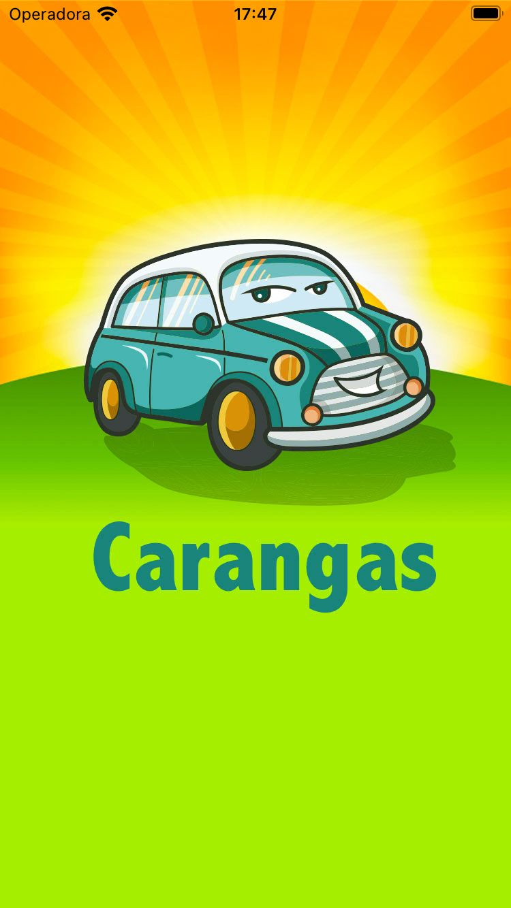
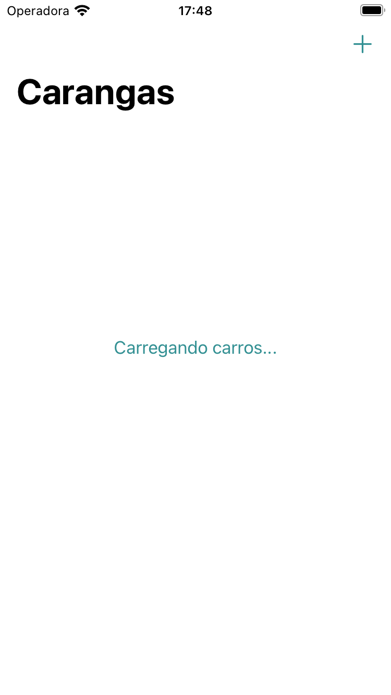
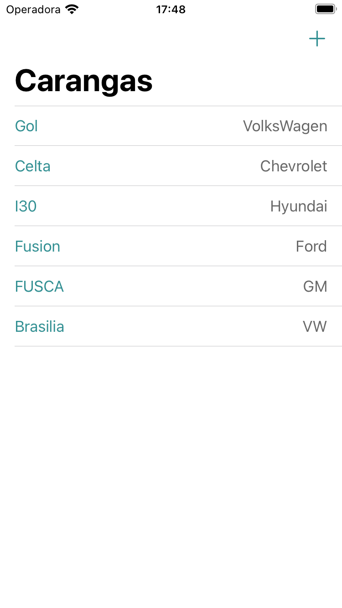
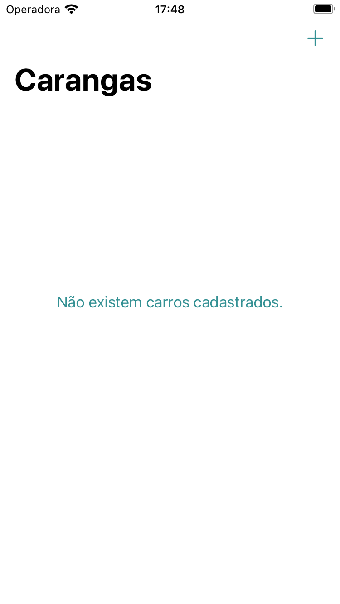

# Carangas
> Aplicativo para desenvolvimento Swift/iOS


## Resumo - REST API

### API

API vem de Application Programming Interface (Interface de Programação de Aplicações) e é um conjunto de rotinas estabelecidas por uma aplicação para que demais aplicações possam utilizar suas funcionalidades sem a necessidade de conhecer os detalhes de sua implementação.

### REST

REST é uma abstração da arquitetura WWW (World Wide Web) que tem como objetivo a definição de uma arquitetura para a construção de aplicações Web seguindo boas práticas. Reafirma os seguintes princípios:

* Um protocolo cliente/servidor (HTTP) sem estado
* Um conjunto de operações bem definidos
    * GET
    * POST
    * PUT
    * DELETE
* Uma sintaxe universal para identificar os recursos
* Uso da hipermídia

### Observação

   > @escaping nos parâmetros assegura que os sistema reterá o parâmetro/closure para execução após o método ter sido encerrado.

```swift
//Utilizado @scaping para a closure ser "segurada" e poder ser executada mesmo após a conclusão do método.
class func save(car: Car, onComplete: @escaping (Bool) -> Void) {
    applyOperation(car: car, operation: .save, onComplete: onComplete)
}
```

## Conceitos abordados

* Linguagem
    * Swift 5.5

* Auto Layout
    * Constraint
    * Assets
    * ColorSet

* Components
    * UIView
    * UILabel
    * UIImage
    * UITextField
    * UIActivityIndicatorView
    * UISegmentedControl
    * UIButton
    * UITableView
    * UIPickerView
    * UINavigationController
        * Large Title
        * Navigation Item
        * Bar Button Item
    * Propriedades computadas
    * Segue
    * WKWebView
    

## Snapshots

  
<br/>

 
<br/> 

  
<br/>

 
<br/> 

  
<br/>